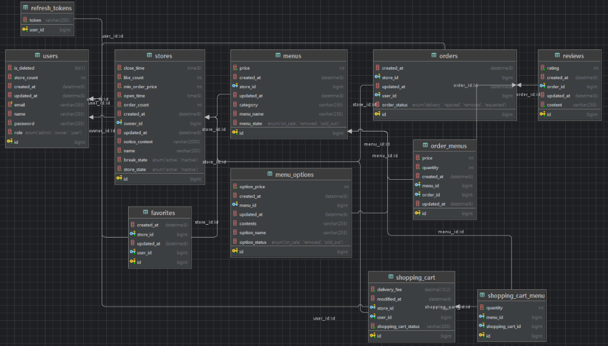
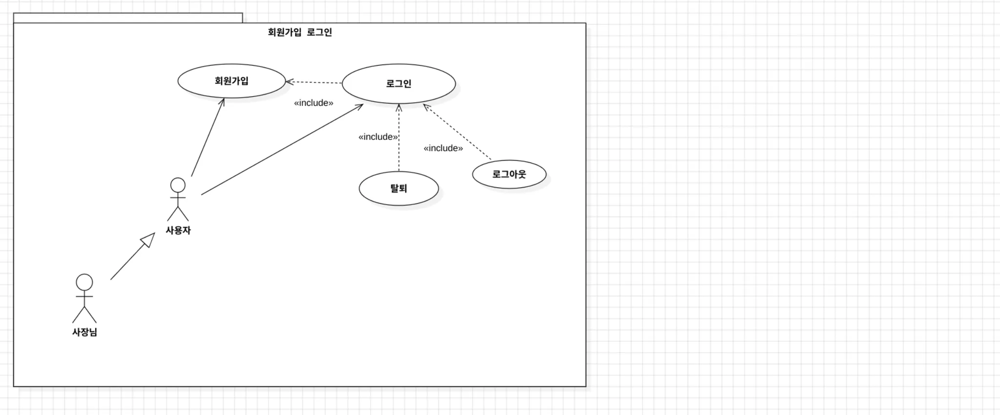
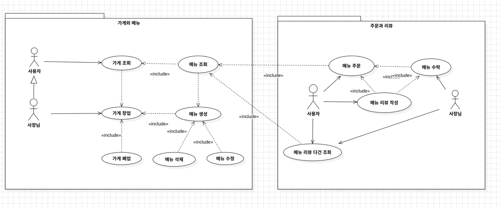
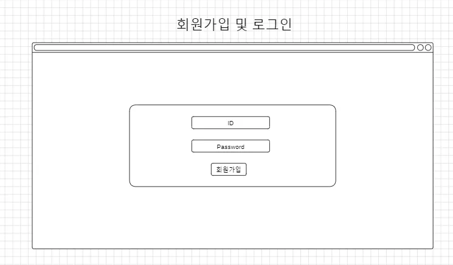
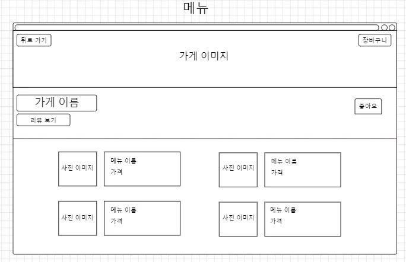

# Foodduck
배고픔? 우리가 책임진다! - 미친 속도의 배달로 음식이 눈 깜짝할 사이 도착하는 "푸드득"

---

## 프로젝트 목표
Spring Boot와 MySQL을 사용하여 짧은 기간동안 제작한 배달 어플리케이션 백엔드 파트입니다. view는 따로 구현하지않고,
와이어 프레임을 그리며 제작하였습니다.

- Java : 17
- Spring Boot : 3.4.2
---
## 주요기능
### 1.사용자 관리

- 회원가입
- 로그인
- 사용자 정보 조회
- 비밀번호 수정
- 사용자 탈퇴

### 2. 가게

- 가게 생성 : 새로운 가게를 생성합니다. Owner만 생성 가능하며, 1명당 최대 3개의 가게를 생성할 수 있습니다.
- 가게 검색 : 검색시 결과가 여러개일 때는 가게 명이 나오고, 검색시 결과가 1개일 때는, 가게의 세부내용(가게명, 메뉴, 공지사항)이 같이 표시됩니다.
- 가게 수정 : 선택한 가게의 정보를 수정할 수 있습니다.
- 공지사항 수정 : 단건 조회시 표시되는 가게의 공지사항을 수정할 수 있습니다.
- 가게 삭제 : 가게를 삭제할 수 있습니다.

### 3. 메뉴

- test

### 4. 주문
- test

### 5. 리뷰
- test

### 6. 장바구니
- test

### 7. 관리자 대시보드
- test

### 8. 찜 목록

- 찜목록 추가 : 사용자가 원하는 가게를 찜 목록에 추가할 수 있습니다.
- 찜목록 삭제 : 사용자가 선택한 가게를 찜 목록에서 삭제할 수 있습니다.
- 찜목록 조회 : 사용자가 찜 목록에 추가한 가게들을 모아 볼 수 있습니다.

---
## 프로젝트 요구사항

## 팀원 소개
| 남윤재 | 문성준 | 서지원 | 이범서 | 이호수 |
|-----|-----|-----|-----|-----|
| 팀장  | 팀원  | 팀원  | 팀원  | 팀원  |

## ERD

## UseCase

## API명세서

## 와이어프레임

